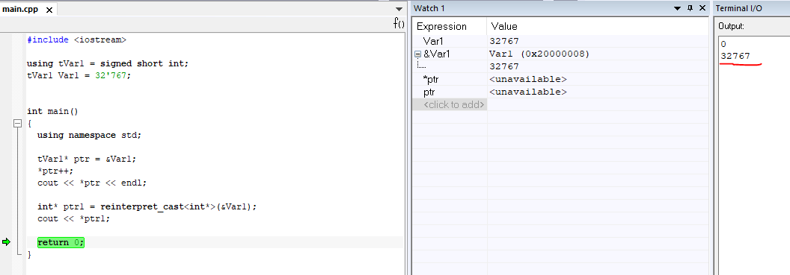
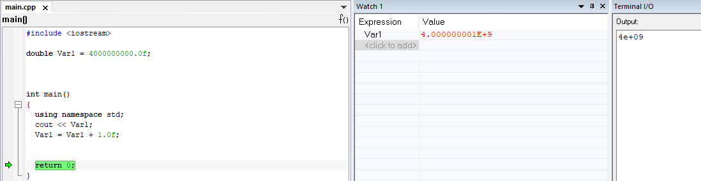

== Работа в IAR Embedded Workbench
Сперва был создан проект C++ в программе *IAR Embedded Workbench* (рисунок 1)

.Создание проекта в программе

=== Изучение переменной типа *unsigned short*

Создадим глобальную переменную типа _**unsigned short**_ и присвоим ей значение _65535_. После этого нам нужно
прибавить единицу к переменной. Так как число _65535_ имеет тип _int_, то компилятор делает
неявное преобразование _int_ к _**unsigned short int**_.

Поэтому, чтобы компилятор лучше понимал, следует записать строку объявления переменной следующим образом:

_**short unsigned int Var1 = static_cast<short unsigned int>(65'535U); **_

Полученный код
будет выглядеть следующим образом (рисунок 2).

.Полученный код
image::photos/2.png[]

После этого запустим программу и откроем терминал через меню _View - Terminal I/O_ (рисунок 3).

.Открытие терминала
image::photos/3.png[]

.Окно терминала

Нажимая на клавишу _**F10**_, запустим пошаговую отладку, внимательно следя за значением переменной
_**Var1**_ (рисунок 5).

.Результат выполнения

Как мы можем заметить, при добавлении единицы к переменной _**Var1**_, у нас получился ноль.
Почему же это произошло?

А случилось это потому что произолшла потеря бит из-за того,
что переменной не было выделено достаточно памяти для
их хранения и произошло переполнение переменной.

В нашем случае переменная типа *unsigned short* может
занимать 2 байта, а число _65536_ уже занимает 3 байта,
то есть _1111 1111b + 1b = 1 0000 0000b_  (два младшие байты равны 0) (рисунок 6).

.Диапазон данных

=== Изучение переменной типа *signed short*

Следующим заданием было поменять тип
переменной на *signed short* и присвоить ей значение _32767_.
Полученный код выглядит следующим образом (рисунок 7).

.Полученный код

Запустим отладку и посмотрим на результат (рисунок 8).

.Результат выполнения

Как мы можем заметить, у нас из числа _32 767_ при добавлении единицы получилось число
_-32 768_. Почему так произошло?

В данной ситуации тоже случилось переполнение
переменной, в которой старший бит зарезервирован под знак числа.
После того как он заполнился, число превратилось в
максимально возможное отрицательное (рисунок 9).

.Диапазон данных

=== Вывод адреса переменной в терминал
Следующее задание звучит следующим образом: "_Не меняя
тип переменной взять адрес переменной
(оператор &) - вывести адрес переменной в терминал_".

Не изменяя тип переменной в программе добавим новую строчку:

_**cout << &Var1 << endl;**_

Эта строка будет отвечать за вывод адреса переменной в терминал. Запустим отладку
и посмотрим на результат (рисунок 10).

.Вывод адреса переменной в терминал и окно _Watch_

Как можем заметить, в терминал вывелся адрес переменной:  _0x20000008_. А также, мы сравнили между собой значения, полученные
в окне теримнала и _Watch_. Как можем заметить, они совпадают.

=== Явное преобразование адреса переменной

Далее, необходимо не меняя переменной выполнить явное преобразование адреса
переменной к типу _указатель_ на _short_ используя
*reinterpret_cast* и присвоить локальной переменной типа *short**.

*reinterpret_cast* преобразует типы, несовместимыми друг с другом.

Изменим код в *IAR*:

.Изменённый код:

Запустим программу и посмотрим на результат:

.Результат выполнения

После выполнения операций можно сделать вывод о том, что адрес переменной и
указатель, который
хранит адрес этой переменной равны между собой,
так как *signed short* и *short* являются одним и тем же.

Попробуем вывести значение переменной с этого адреса, добавив строку

_**cout << *ptr << endl**_;

и заметили,
что по адресу лежит значние _-32768_, которое мы записали до этого по данному адресу.

=== Разыменовавание указателя

Задание: _Разыменовать указатель и
вывести в терминал значение лежащее по адресу, указанному в указателе._

// Разыменовать значит, что по адресу, который хранится в указателе записываем.

.Результат выполнения

Запишем по адресу, который хранится в указателе значение _5_.
Попробуем проверить это используя окно _Watch_ и _Memory_, записав переменную _ptr_ в поле _Expression_.
Затем в окне _Memory_ перейдем по адресу _0x20000000_ и посмотрим, что произошло.

.Начало программы

Заметим, что в данный момент по адресу _0x20000000_ записано число _32 767_ в _Hexademical_ формате.
Теперь продолжим выполнение программы и заметим следующее:

.Конец программы

Теперь по адресу _0x20000000_ записана пятерка.

Произведём явное преобразование этого указателя к типу указателя на _int_, разыменуем и выведем значение, лежащее по адресу указателя.
//(int*)

.Полученный результат

Было замечено, что при проведении всех этих этих операций мы
получили число 5, типа int, лежащее по адресу указателя.

Теперь попробуем добавить к _***ptr**_ единицу:

.Полученный код и запуск отладки

.Ход работы

.Зваершение отладки

Как можем заметить, _***ptr**_ изменилось с _32767_ на _0_, так как указатель стал указывать на
другую область памяти, в которой хранится ноль.

А вот значение _**ptr**_ изменилось с _0x20000008_ на _0x2000000A_. Это произшло потому что
_**short**_ - 2-байтовый тип переменной и мы прибавили к восьмерке 2 и получилось 10 (то есть A, в 16-разрядном формате).

=== Повторное исследование переменной типа *short*

Необходимо заменить тип переменной с _unsigned short_ на _short_ и присвоить ей значение _65 535_.

.Полученный результат

При выполнении данного задания мы получили, что при изменении типа переменной на _short_ со
значением _65 535_ в терминале получаем _-1_.

Это получается потому что наибольшее число, которое можно без
переполнения положить - это _32 767._
А число _65 535 = (32 767 + 1) + 32 767= -32 768 + 32 767 = -1_

Далее нужно сделать явное преобразование типа к _short_ и объяснить
полученный результат. После добавления

_**cout << static_cast<short>(myVar) << endl;**_

Запустим программу и посмотрим на результат:

.Полученный результат
image::photos/18.png[]

Как можно заметить, после явного преобразования мы получили такое же значение _-1_.
Это произошло из-за того, что мы производим явное преобразование к такому же
типу данных, которым он был до преобразования.

Теперь попробуем преобразовать переменную к типу _**unsigned short**_, получим следующий результат:

.Полученный результат

Получилось значение _65535_. Способ получения данного числа является обратным к тому, что было описано в
предыдущем пункте: _-1 = -32 768 + 32 767 = (32 767 + 1) + 32 767 = 65 535_

Теперь преобразуем к типу _int_, получим:

.Полученный результат

Тут ничего не изменилось, так как при преобразовании из _short int_ в тип _int_
значение _-1_ будет прежним.

=== Изучение переменной типа float

Следующим заданием было создание переменной типа
float и присвоение ей значения _40'000'000'000F_. А также, прибавление единицы
к этому значению и вывод в окно _Watch_.

.Полученный результат

Как можем заметить, результаты в окнах _Watch_ и _Terminal_ не отличаются, так как у
типа _float_ не хватает точности, чтобы отобразить прибавленную нами единицу.

Теперь заменим тип _float_ на _double_ и произведём аналогичные действия (рисунок 20).

.Полученный результат

Отметим, что при смене типа данных переменной с _float_ на _double_
в окнах _Watch_ и _Terminal_
значения стали разными, так как у _double_  точность в два раза выше чем у _float_, единица отобразилась.

